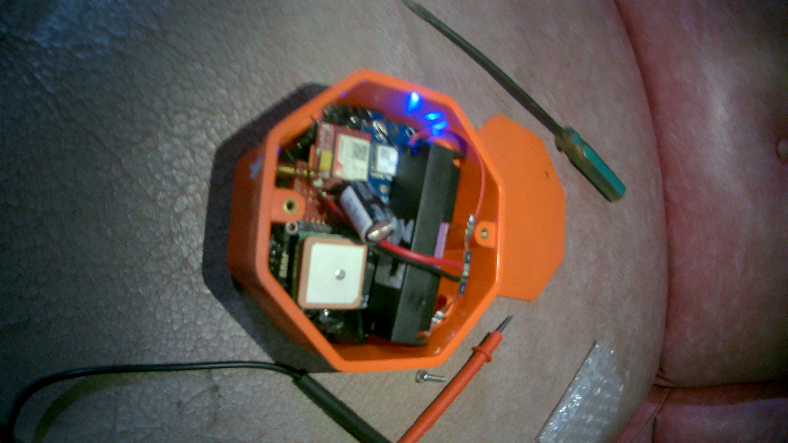
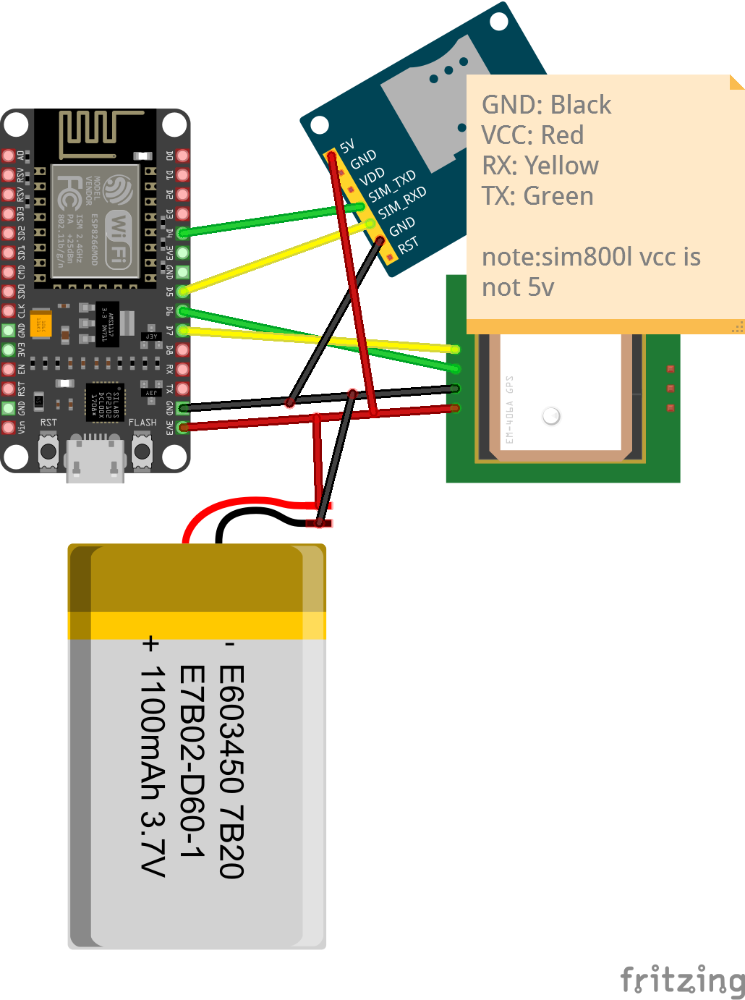

# 📍 SMS GPS Tracker

Track your stuff! This DIY GPS tracker uses an ESP8266, SIM800L, and NEO-6M GPS module to send you location updates via text message.

## 🚀 What it does
- Text `CHECK` to your device and boom - it replies with GPS coordinates!
- Built with SIM800L for cellular magic and NEO-6M for GPS tracking
- Perfect for keeping tabs on your projects, bikes, or whatever needs tracking

## 🛠️ Quick Start
1. Flash the code to your NodeMCU
2. Send "CHECK" via SMS
3. Get your location back instantly!

## 📜 License
MIT - build, break, remix, repeat!
